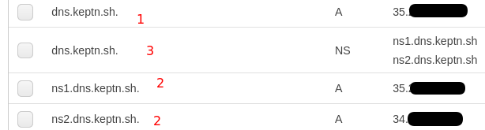

# dns.keptn.sh

Please note: This is a customized fork of [exentriquesolutions/nip.io](https://github.com/exentriquesolutions/nip.io) tailored for the needs 
[Keptn](https://keptn.sh). Use at own risk.

The docker image generated out of this repo is available at [docker.io/keptn/dns.keptn.sh](https://hub.docker.com/r/keptn/dns.keptn.sh).

## Build

See [build.sh](build.sh) for building the docker image.

## VM Setup

While the setup will work with one VM, we stronlgy recommend using at least two VMs that are in different geographic regions (depending on where your users will be sitting).

The VMs will just need a Docker daemon, Internet access and Port 53 needs to be opened within the firewall.

## DNS Configuration

To use this service, the following configuration needs to be taken on your DNS provider:

1. Create your primary domain (e.g., dns.keptn.sh) with an *A record* pointing to your primary server
2. Create two sub-domains ns1 and ns2 (e.g., ns1.dns.keptn.sh and ns2.dns.keptn.sh) pointing to the primary and secondary server (if you don't have a secondary, point it to the primary server for now)
3. Create a *NS record*  for your primary domain (e.g., dns.keptn.sh), pointing to the ns1 and ns2 domains

**Example config:**

# ORIGINAL NIP.IO Documentation

[NIP.IO](http://nip.io) is powered by [PowerDNS](https://powerdns.com) with a simple, 
custom [PipeBackend](https://doc.powerdns.com/authoritative/backends/pipe.html): 
[backend.py](nipio/backend.py)

Head to [NIP.IO](http://nip.io) for more details.

NIP.IO is licensed under [Apache 2.0](LICENSE.txt), and is a free service run by
[Exentrique Solutions](http://exentriquesolutions.com)

## Environment Variables Configuration Overrides

While all configuration settings can be specified in a file called [backend.conf](nipio/backend.conf), the following
environment variables override those:

`NIPIO_DOMAIN`: NIP.IO main domain.

`NIPIO_TTL`: Default TTL for  NIP.IO backend.

`NIPIO_NONWILD_DEFAULT_IP`: Default IP address for non-wildcard entries.

`NIPIO_SOA_ID`: SOA serial number.

`NIPIO_SOA_HOSTMASTER`: SOA hostmaster email address.

`NIPIO_SOA_NS`: SOA name server.

`NIPIO_NAMESERVERS`: A space seperated list of domain=ip nameserver pairs. Example: `ns1.nip.io=127.0.0.1 ns2.nip.io=127.0.0.1`.

`NIPIO_BLACKLIST`: A space seperated list of description=ip blacklisted pairs. Example: `some_description=10.0.0.1 other_description=10.0.0.2`.

This is useful if you're creating your own [Dockerfile](Dockerfile).
